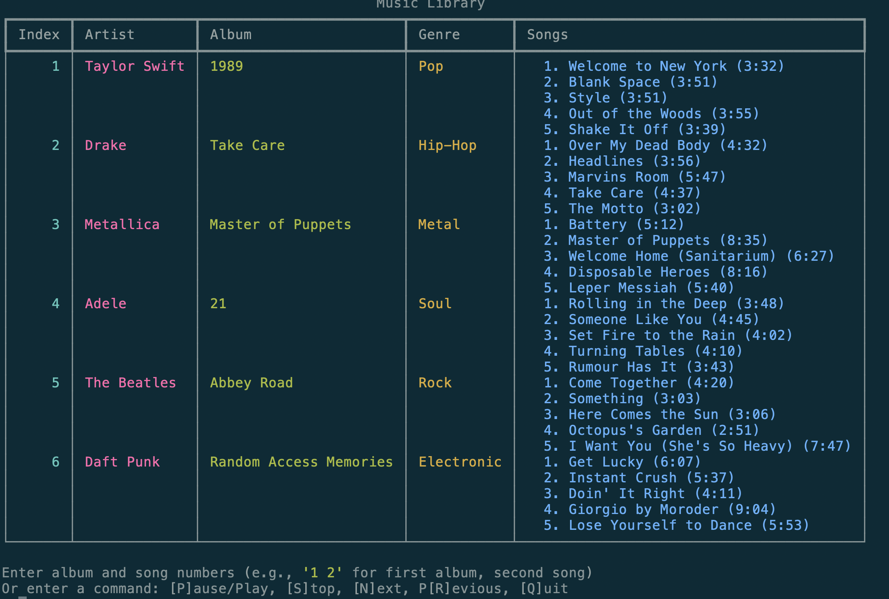
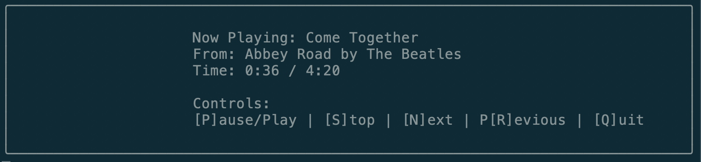
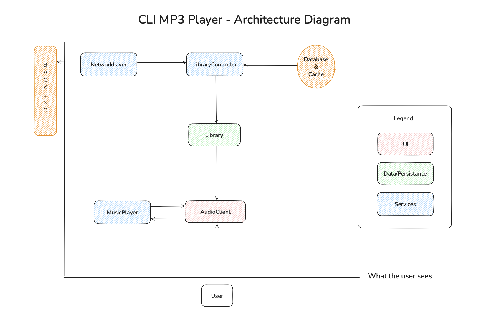
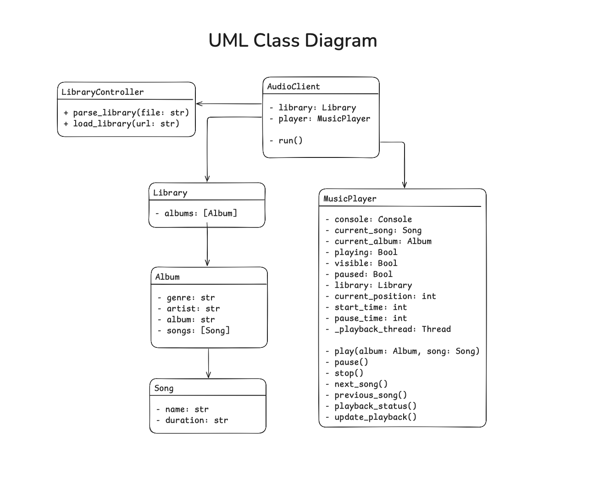

# AudioPlayer

AudioPlayer is a simple audio player CLI in python that reads a JSON file upon invocation.

## Features

- Play, pause, and stop audio tracks
- Select Next or Previous tracks
- CLI based User-Interface

## Installation

To install AudioPlayer, follow these steps:

1. Clone the repository:
    ```bash
    git clone https://github.com/gleete/AudioPlayer.git
    ```
2. Navigate to the project directory:
    ```bash
    cd AudioPlayer
    ```
3. Install the necessary dependencies:
    ```bash
    python3 -m pip install -r r.txt
    ```

## Usage

To start using AudioPlayer, run the following command:
```bash
    cd src
    python3 AudioPlayer.py --library ../ExampleData/example_album_list.json
```

In order to play a song, select an album from an index, along with an appropriate song. For instance, to select ```Come Together by The Beatles```, one would select `5 1` and return.

To toggle the current playback view:
```
v - view currently playing
```

Once the playback view is showing, the user can enter commands for controlling the playback:
``` bash
p - play/pause
s - stop
n - next song
b - previous song
l - library view
q - quit
```
Navigating back to the library view while a song is playing does not stop playback.
To go back to the playback view, the user can type the command "v".
The remaining commands (p, s, n, r) are supported in the library view to control playback.


From here once can navigate using the player view


## Architecture


The CLI-specific functionality is contained in the class AudioClient, where the argument parsing and rendering of the initial view are handled. The AudioClient initialization requires a path to a json file, which is supposed to be the source of the music library data. For this initial version of the player, this path is passed as a mandatory input argument when invoking AudioPlayer.py. 
The AudioClient uses the LibraryController to load the library. The LibraryController is able to initialize the Library from different sources. The only source supported currently is from file. In the future, we would implement a NetworkLayer class that knows how to vend data from a backend, which the LibraryController then know how to translate into Library instances.

The class Library retains the full library data, all albums and their songs in memory.

There is a MusicPlayer class that is responsible for the playback functionality, as well as the playback view.
A MusicPlayer has 2 dependencies: a Library and a console, the former for information related to songs/albums and the latter for rendering the playback view.

The Client loads the library first, and then initializes a MusicPlayer. It holds reference to those 2 things while it is alive/running.

When a song is selected to be played, MusicPlayer starts playback and creates a thread which calculates the progress of the player and renders updated state on the console. In the meatime Client is on its own loop awaiting for commands and forwards the appropriate actions to the player.


The json structure chosen for the sake of this project can be seen in ExampleData.
    
+ [example_album_list.json](./ExampleData/example_album_list.json)

# Class & function Hiergharchy



+ [AudioClient](./src/AudioPlayer.py)
    - `library: Library`
    - `player: MusicPlayer`
    - -----
    - `run()`
+ [Song](./src/Library.py)
    - `name: str`
    - `duration: str`
+ [Album](./src/Library.py)
    - `genre: str`
    - `artist: str`
    - `album: str`
    - `songs: [Song]`
+ [Library](./src/Library.py)
    - `albums: [Album]`
+ [LibraryController](./src/LibraryController.py)
    - `parse_library(file: str)`
    - `load_library(url: str)`
    
+ [MusicPlayer](./src/MusicPlayer.py)
    - `console: Console`
    - `current_song: Song`
    - `current_album: Album`
    - `playing: Bool`
    - `visible: Bool`
    - `paused: Bool`
    - `library: Library`
    - `current_position: int`
    - `start_time: int`
    - `pause_time: int`
    - `_playback_thread: Thread`
    ---
    - `play(album: Album, song: Song)`
    - `pause()`
    - `stop()`
    - `next_song()`
    - `previous_song()`
    - `playback_status()`
    - `update_playback()`

# Considerations

For the initial version of this project some decisions were made that can be improved with a bigger investment to the project:

- The playback view is separate from the library view, which introduces a caveat: the MusicPlayer now is responsible for rendering state on top of the actual playback. In a future version we can probably resolve this by exposing playback state and refactor Client to solely own the logic of updating the console. Perhaps an additional object to be responsible for the layout of what is rendered, that is used by Client directly would be even cleaner.

- The LibraryController contains class methods. Normally the controller class has a lot more functionality, for maybe saving user personalized info like playlists, and it would end up being an object we want to hold state in memory for and thus converting the class methods to instance methods and the Client keeping one instance in one of its properties.

- Shuffle and Repeat functionality is not in the implemented skeleton, however it would end up living in the MusicPlayer.

- When a user plays a song, the player will continue playing until the end of the library. Depending on what experience we want to provide for the user we could stop playing at the end of the album.

- Caching would be introduced if/when we fetch data from the network, or some remote database. That would be hooked in the LibraryController layer. Possibly introduce separate caching to the Song and Album layer accordingly. The models are too thin to make it worth implementing now.

- Helper methods need to be added on the Album and Song classes, for easy access to related objects, filtering, etc


## Design Document


## Assumptions
* User provides JSON doc
* Keep playing until there is no music left (between albums)

## Future Features
- Shuffle and repeat playback modes
- Music streaming via the Web
- Persistent state

## Contact

For any questions or suggestions, please contact us at [gordo.leete@gmail.com](mailto:gordo.leete@gmail.com).

Enjoy your music with AudioPlayer!